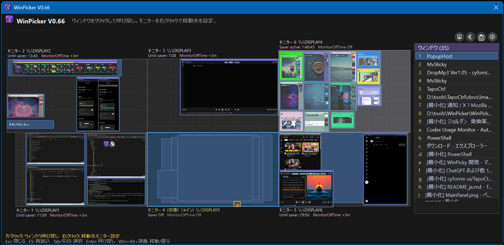

# WinPicker v0.68

[English](#english)

## メインパネル / Main panel



## 日本語

WinPicker は、複数モニター上のウィンドウをミニマップから選び、指定したモニターへ呼び戻せる Windows 11 用タスクトレイユーティリティです。

### v0.33 から v0.68 の主な更新

- モニター単位のスクリーンセーバーを追加しました。待機時間を全体またはモニター別に設定でき、黒画面・時計・日付・時計と日付から表示を選べます。
- 動画・音声再生中のモニターではスクリーンセーバーを抑制するメディア判定を追加しました。
- スクリーンセーバー開始前の残り時間を表示するデバッグオプションを追加しました。
- Tapo 電源制御を追加しました。モニターごとにデバイス IP を設定し、スクリーンセーバー開始後の自動 OFF、操作再開時の ON、右クリックメニューからの手動 ON/OFF が行えます。
- ミニマップからウィンドウ単体、または指定モニター上のアプリをまとめて最小化・復元できるようになりました。
- ピッカー外をクリックしたときに自動で閉じる動作を追加しました。
- 起動時のスプラッシュ画面と、埋め込み XML を使った一元的なバージョン表示を追加しました。
- ウィンドウ移動・復元、最小化状態、モニター識別、設定保存の安定性を改善しました。
- 日本語・英語 UI、ダークテーマ、アイコンおよびブランド画像を更新しました。
- 日別動作ログ、ログレベル、詳細ログ、完了週のZIP自動アーカイブを追加しました。
- Windows UIカルチャに基づく言語判定へ統一し、非日本語環境の英語表示を補完しました。

### 主な機能

- `Win + Alt + Space` でピッカーを表示・非表示
- `Win + Alt + Z` で直前のウィンドウ移動を復元
- `Win + Alt + P` で全モニターのスクリーンショットを保存
- ミニマップと右側一覧からウィンドウを選択して移動
- ウィンドウ位置とデスクトップアイコン配置の保存・復元
- モニター別スクリーンセーバー、最小化、Tapo 電源制御
- 日本語 Windows では日本語、それ以外では英語 UI

### TapoCtrlとの連携

WinPickerのモニター電源制御は、[TapoCtrl](https://github.com/cyfomix-ui/TapoCtrl) のHTTP APIを利用します。モニターごとにTapoスマートプラグのIPアドレスを割り当てると、スクリーンセーバー開始後の自動OFF、操作再開時のON、モニターメニューからの手動ON/OFFが可能です。

1. TapoCtrlを起動し、対象のTapo機器を登録します。
2. TapoCtrlのWebサーバーを有効にします。
3. WinPickerの設定で「Tapo制御URL」をTapoCtrlの `/api/power` に合わせます。
4. WinPickerのモニターメニューで電源制御を有効にし、そのモニターに対応するTapo機器IPを入力します。

TapoCtrlの既定ポートは`8080`、WinPickerに同梱されている設定の既定値は`8900`です。次のどちらかに統一してください。

- TapoCtrlを既定のまま使う: WinPickerのTapo制御URLを `http://127.0.0.1:8080/api/power` に変更
- WinPickerの既定値を使う: TapoCtrlのWebサーバーポートを`8900`に変更

TapoCtrlを別PCで動かす場合は、`127.0.0.1`をそのPCのLAN IPへ置き換え、TapoCtrlのBind設定とWindows Firewallを適切に構成してください。API自体には認証がないため、信頼できるLAN以外へ直接公開しないでください。

### 必要環境とビルド

- Windows 11
- .NET 8
- Visual Studio 2022（`.NET デスクトップ開発` ワークロード推奨）

```powershell
dotnet build .\WinPicker.sln -c Release
dotnet publish .\WinPicker\WinPicker.csproj -c Release -r win-x64 --self-contained true /p:PublishSingleFile=true /p:PublishTrimmed=false
```

`Build.ps1 -NoRun` でも、クリーン後に自己完結型の単一 EXE を発行できます。設定とログは `%APPDATA%\Cyfomix\WinPicker` に保存されます。

## English

WinPicker is a Windows 11 task-tray utility for selecting windows from a multi-monitor minimap and bringing them to a chosen monitor.

### Highlights since v0.33

- Added per-monitor screen savers with global or per-display idle times and black, clock, date, or clock-and-date modes.
- Added media detection to suppress the saver on monitors playing video or audio.
- Added an optional debug countdown showing the remaining time before each saver starts.
- Added Tapo power control with per-monitor device IPs, delayed automatic power-off, wake power-on, and manual On/Off commands in the monitor menu.
- Added commands to minimize or restore one window or all applications on a selected monitor.
- Added automatic picker closing when the user clicks outside it.
- Added a startup splash screen and centralized version display backed by embedded XML metadata.
- Improved window move/restore behavior, minimized-state handling, monitor identification, and settings persistence.
- Updated Japanese/English UI text, dark styling, icons, and branding assets.
- Added daily operation logs, selectable log levels, detailed logging, and automatic weekly ZIP archives.
- Standardized language detection on the active Windows UI culture and completed English fallbacks for non-Japanese environments.

### Key features

- Show or hide the picker with `Win + Alt + Space`
- Restore the previous window move with `Win + Alt + Z`
- Capture all monitors with `Win + Alt + P`
- Select and move windows from the minimap or right-side list
- Save and restore window geometry and desktop icon layouts
- Per-monitor screen saver, minimize/restore, and Tapo power controls
- Japanese UI on Japanese Windows; English UI otherwise

### TapoCtrl integration

WinPicker uses the HTTP API provided by [TapoCtrl](https://github.com/cyfomix-ui/TapoCtrl) for monitor power control. Assign a Tapo smart-plug IP address to each monitor to power it off after the screen saver starts, power it on when activity resumes, or send manual On/Off commands from the monitor menu.

1. Start TapoCtrl and register the target Tapo devices.
2. Enable the TapoCtrl web server.
3. Set WinPicker's `Tapo control URL` to TapoCtrl's `/api/power` endpoint.
4. Enable power control in the WinPicker monitor menu and enter the Tapo device IP assigned to that monitor.

TapoCtrl uses port `8080` by default, while WinPicker's bundled configuration currently uses `8900`. Make the ports match using either option:

- Keep the TapoCtrl default: change WinPicker's URL to `http://127.0.0.1:8080/api/power`
- Keep the WinPicker default: change the TapoCtrl web-server port to `8900`

If TapoCtrl runs on another PC, replace `127.0.0.1` with that PC's LAN address and configure the TapoCtrl bind setting and Windows Firewall appropriately. The API does not provide authentication, so do not expose it directly outside a trusted LAN.

### Requirements and build

- Windows 11
- .NET 8
- Visual Studio 2022 with the `.NET desktop development` workload recommended

```powershell
dotnet build .\WinPicker.sln -c Release
dotnet publish .\WinPicker\WinPicker.csproj -c Release -r win-x64 --self-contained true /p:PublishSingleFile=true /p:PublishTrimmed=false
```

You can also run `Build.ps1 -NoRun` to clean and publish a self-contained single EXE. Settings and logs are stored under `%APPDATA%\Cyfomix\WinPicker`.

See [WinPicker/README.md](WinPicker/README.md) for detailed controls and settings. See [ASSETS_LICENSE.md](ASSETS_LICENSE.md) for bundled asset terms.
