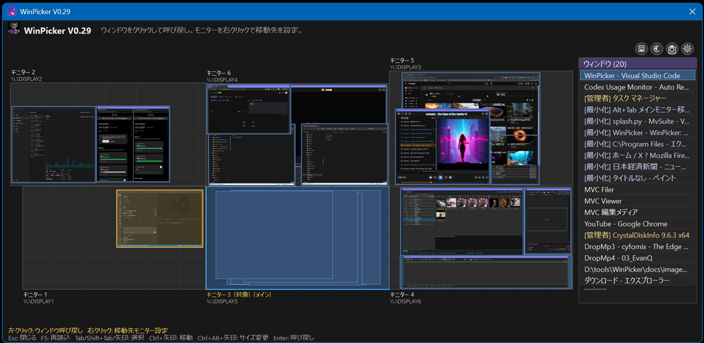

# WinPicker

**WinPicker** は、複数モニター環境で散らばったウィンドウを、ミニマップから選んで指定モニターへ呼び戻す Windows 向けタスクトレイ常駐ツールです。

Alt+Tab や Win+Tab だけでは探しづらいウィンドウ、別モニターの奥に隠れたウィンドウ、最小化されたウィンドウを、一覧とミニマップから素早く見つけて前面へ戻せます。

現在のミニ画面は `WinPicker V0.29` のようにバージョンを表示します。

GitHub: https://github.com/cyfomix-ui/

---

## 画面イメージ



---

## 特徴

- Windows 11 向けのタスクトレイ常駐アプリ
- `Win + Alt + Space` でウィンドウ選択ミニ画面を表示
- `Win + Alt` の長押しで、マウスカーソルをタスクトレイ付近へ移動
- 左Alt / 右Alt のダブルタップで、マウスカーソルをタスクトレイ付近へ移動
- `RightAlt + Space` で右手側操作としてミニ画面を表示
- `RightAlt + Z` で右手側操作として直前の移動を戻す
- 複数モニターをミニマップとして表示
- 各ウィンドウをサムネイルまたは文字枠として表示
- 右側リストでウィンドウ名を一覧表示
- 管理者権限で起動しているウィンドウを判定できた場合、`[管理者]` と表示
- ウィンドウをクリックまたは Enter で指定モニターへ移動
- 最小化ウィンドウも一覧に表示し、選ぶと復元して移動
- `Win + Alt + Z` で直前の移動を元に戻す
- `Win + Alt + P` で全画面スクリーンショットを保存
- 移動先モニターを右クリックメニューから設定可能
- 設定画面からホットキーや表示位置を変更可能
- リスト上部アイコンから、ジオメトリ保存 / 復元 / 全画面キャプチャ / 設定画面を実行可能
- ウィンドウ配置とデスクトップアイコン位置をジオメトリとして保存 / 復元
- 日本語OSでは日本語表示、日本語以外では英語表示
- ダークテーマのミニ画面 / About画面 / メニュー
- 単一EXEとして発行可能

---

## 動作環境

- Windows 11
- .NET 8
- Visual Studio 2022 推奨
- 複数モニター環境推奨

開発・ビルドには Visual Studio の **.NET デスクトップ開発** ワークロードが必要です。

---

## 基本操作

| 操作 | 内容 |
|---|---|
| `Win + Alt + Space` | ミニ画面を表示 / 非表示 |
| `Win + Alt` 長押し | マウスカーソルをタスクトレイ付近へ移動 |
| 左Alt ダブルタップ | マウスカーソルをタスクトレイ付近へ移動 |
| 右Alt ダブルタップ | マウスカーソルをタスクトレイ付近へ移動 |
| `RightAlt + Space` | 右手側操作としてミニ画面を表示 |
| `RightAlt + Z` | 右手側操作として直前の移動を戻す |
| `Win + Alt + Z` | 直前に移動したウィンドウを元の位置へ戻す |
| `Win + Alt + P` | 全画面スクリーンショットを保存 |
| `Esc` | ミニ画面を閉じる |
| `F5` | ウィンドウ一覧を再読み込み |
| `Tab` / `Shift + Tab` | ウィンドウ選択を移動 |
| 矢印キー | ウィンドウ選択を移動 |
| `Ctrl + 矢印キー` | ミニ画面自体を移動 |
| `Ctrl + Alt + 矢印キー` | ミニ画面サイズを変更 |
| `Enter` | 選択中のウィンドウを呼び戻す |
| リスト上で `Ctrl + マウスホイール` | リスト文字サイズを変更 |

---

## 使い方

1. WinPicker を起動します。
2. タスクトレイに WinPicker アイコンが表示されます。
3. `Win + Alt + Space` を押すか、タスクトレイアイコンをクリックします。
4. 複数モニターのミニマップとウィンドウ一覧が表示されます。
5. 呼び戻したいウィンドウをクリックします。
6. 選んだウィンドウが設定済みのモニターへ移動し、前面に表示されます。

ミニ画面右側のリストでは、ウィンドウ名、最小化状態、管理者権限状態などを確認できます。

---

## ミニ画面のアイコン

右側リストの上には、丸囲みのアイコンボタンがあります。

| アイコン | 内容 |
|---|---|
| 保存アイコン | 現在のウィンドウ配置とデスクトップアイコン位置をジオメトリとして保存 |
| 復元アイコン | 保存済みジオメトリを復元 |
| カメラアイコン | 全画面スクリーンショットを保存 |
| 歯車アイコン | 設定画面を開く |

各アイコンにマウスを乗せると、機能説明のツールチップが表示されます。

---

## ジオメトリ保存 / 復元

WinPicker は、現在のウィンドウ配置を「ジオメトリ」として保存できます。

保存内容:

- ウィンドウ位置
- ウィンドウサイズ
- どのモニター上にあるか
- 最小化 / 通常 / 最大化の状態
- デスクトップアイコン位置

保存名は日時で自動作成されます。保存数は最大8個です。

保存先はレジストリです。

```text
HKEY_CURRENT_USER\Software\Cyfomix\WinPicker\GeometrySnapshots
```

復元時は、保存名ごとにサブメニューが表示されます。

```text
保存名
  ウィンドウ
  アイコン
```

`ウィンドウ` を選ぶとウィンドウ配置を復元します。  
`アイコン` を選ぶとデスクトップアイコン位置を復元します。

デスクトップアイコン位置の保存 / 復元は、Windows Explorer のデスクトップ内部ListViewを扱うため、環境によってはベストエフォートです。Explorer再起動後、アイコン数変更後、並び順変更後などは完全一致しない場合があります。

---

## 全画面スクリーンショット

カメラアイコン、または `Win + Alt + P` で全画面スクリーンショットを保存できます。

保存先:

```text
ピクチャ\WinPicker\yyyyMMdd_HHmmss.jpg
```

ミニ画面からカメラアイコンを押した場合、WinPicker画面を閉じてからスクリーンショットを保存します。

---

## 移動先モニターの設定

ミニ画面上のモニター枠を右クリックすると、移動先モニターを設定できます。

```text
モニターを右クリック
→ このモニターに移動
```

設定した移動先は、設定ファイルとレジストリに保存されます。

保存先レジストリ:

```text
HKEY_CURRENT_USER\Software\Cyfomix\WinPicker
```

---

## 設定画面

タスクトレイアイコンを右クリックすると、以下のメニューが表示されます。

- 表示
- 直前の移動を戻す
- 設定
- WinPickerについて
- ログフォルダを開く
- 終了

ミニ画面右上の歯車アイコンからも設定画面を開けます。歯車アイコンから設定を開く場合、WinPicker本体はいったん閉じ、設定画面だけを表示します。

「設定」では、以下を変更できます。

- ミニ画面表示ショートカット
- 直前の移動を戻すショートカット
- 移動先モニター
- ミニ画面の表示位置
- 呼び戻し後にミニ画面を閉じるか
- トレイ付近へカーソルを移動するか
- WinPickerのトレイアイコン位置を優先するか
- ミニ画面を最前面にするか
- サムネイル表示
- 右側リスト表示

---

## 設定ファイルとログ

v0.16以降、設定ファイルとログはEXE横ではなく、ユーザーごとのAppDataに保存されます。

```text
%APPDATA%\Cyfomix\WinPicker
```

主なファイル:

```text
%APPDATA%\Cyfomix\WinPicker\appsettings.json
%APPDATA%\Cyfomix\WinPicker\logs\yyyy-MM-dd.log
```

単一EXEで別フォルダへコピーしても、設定は同じ場所から読み書きされます。

---

## Visual Studioでビルド

```text
WinPicker.sln
```

を Visual Studio 2022 で開きます。

通常の開発実行:

```text
F5
```

Releaseビルド:

```text
ビルド
→ 構成マネージャー
→ Release
→ ソリューションのビルド
```

通常のReleaseビルドは開発用出力です。EXE単体で配布したい場合は、次の「単一EXE発行」を使ってください。

Visual Studio上の構成が `Any CPU` でも、通常は64bit Windows上で64bitプロセスとして動作します。配布用EXEでは `win-x64` 指定の publish を推奨します。

---

## 単一EXEとして発行

PowerShellで、ソリューションのあるフォルダから以下を実行します。

```powershell
dotnet publish .\WinPicker\WinPicker.csproj -c Release -r win-x64 --self-contained true /p:PublishSingleFile=true /p:PublishTrimmed=false /p:IncludeNativeLibrariesForSelfExtract=true /p:EnableCompressionInSingleFile=true
```

出力先:

```text
WinPicker\bin\Release\net8.0-windows\win-x64\publish\WinPicker.exe
```

この `publish` フォルダ内の `WinPicker.exe` が、単体配布用のEXEです。

---

## 初回起動時の警告について

WinPicker は個人開発の未署名アプリのため、初回起動時に Windows Defender SmartScreen の警告が表示される場合があります。

内容を確認し、信頼できる場合のみ「詳細情報」→「実行」を選択してください。

---

## 既知の制限

- 管理者権限で動いているアプリは、WinPickerも管理者権限で起動しないと制御できない場合があります。
- 管理者権限ウィンドウは判定できた場合、リスト上で `[管理者]` と表示します。
- 一部のUWPアプリ、ゲーム、特殊なフルスクリーンアプリは移動や前面化が効かない場合があります。
- Chrome、Firefox、動画再生、GPU描画系アプリのサムネイルは黒くなる場合があります。
- タスクトレイアイコンの正確な位置取得はWindowsの状態に依存します。取得できない場合はタスクトレイ付近へフォールバックします。
- デスクトップアイコン位置の復元はWindows Explorerの状態に依存します。

---

## ライセンス

ライセンスはリポジトリの `LICENSE` ファイルを参照してください。

---

# WinPicker

**WinPicker** is a Windows tray utility for multi-monitor environments.  
It lets you pick a window from a minimap and summon it to a chosen monitor.

It is designed for users who often lose windows across multiple displays, find Alt+Tab or Win+Tab hard to scan, or want to quickly restore minimized windows to the main working monitor.

The picker title/header shows the current version, such as `WinPicker V0.29`.

GitHub: https://github.com/cyfomix-ui/

---

## Screenshot


---

## Features

- Windows 11 tray utility
- Show the picker with `Win + Alt + Space`
- Hold `Win + Alt` to move the mouse cursor near the task tray
- Double-tap Left Alt or Right Alt to move the mouse cursor near the task tray
- Show the picker with `RightAlt + Space` as a right-hand alternative
- Restore the previous move with `RightAlt + Z` as a right-hand alternative
- Display all monitors as a minimap
- Show windows as thumbnails or text blocks
- Show a synchronized window title list
- Mark elevated windows as `[Admin]` when detectable
- Click or press Enter to summon a window to the target monitor
- Include minimized windows in the list
- Restore minimized windows before moving them
- Restore the previous move with `Win + Alt + Z`
- Save all-screen screenshots with `Win + Alt + P`
- Set the target monitor from the monitor right-click menu
- Configure hotkeys and picker behavior from the Settings dialog
- Save and restore window layout and desktop icon positions
- Japanese UI on Japanese systems, English UI otherwise
- Dark picker window, About dialog, and menus
- Can be published as a single-file EXE

---

## Requirements

- Windows 11
- .NET 8
- Visual Studio 2022 recommended
- Multi-monitor setup recommended

To build from source, install the **.NET desktop development** workload in Visual Studio.

---

## Keyboard shortcuts

| Shortcut | Action |
|---|---|
| `Win + Alt + Space` | Show / hide picker |
| Hold `Win + Alt` | Move mouse cursor near the task tray |
| Double-tap Left Alt | Move mouse cursor near the task tray |
| Double-tap Right Alt | Move mouse cursor near the task tray |
| `RightAlt + Space` | Show picker as a right-hand alternative |
| `RightAlt + Z` | Restore the last move as a right-hand alternative |
| `Win + Alt + Z` | Restore the last moved window |
| `Win + Alt + P` | Save an all-screen screenshot |
| `Esc` | Close picker |
| `F5` | Refresh window list |
| `Tab` / `Shift + Tab` | Move window selection |
| Arrow keys | Move window selection |
| `Ctrl + Arrow keys` | Move the picker window |
| `Ctrl + Alt + Arrow keys` | Resize the picker window |
| `Enter` | Summon selected window |
| `Ctrl + mouse wheel` on the list | Change list font size |

---

## Usage

1. Start WinPicker.
2. The WinPicker icon appears in the task tray.
3. Press `Win + Alt + Space`, or click the tray icon.
4. The monitor minimap and window list appear.
5. Click a window or select one and press Enter.
6. The selected window is moved to the configured target monitor and brought to the front.

The right-side list shows window titles, minimized status, and elevated/admin status when detectable.

---

## Picker action icons

Above the right-side window list, WinPicker shows round icon buttons.

| Icon | Action |
|---|---|
| Save | Save the current window layout and desktop icon positions |
| Restore | Restore a saved layout |
| Camera | Capture all screens |
| Gear | Open Settings |

Hovering over each icon shows a tooltip.

---

## Layout save / restore

WinPicker can save the current desktop layout.

Saved data:

- Window position
- Window size
- Monitor placement
- Minimized / normal / maximized state
- Desktop icon positions

Snapshot names are generated from the current timestamp. Up to 8 snapshots are kept.

Registry path:

```text
HKEY_CURRENT_USER\Software\Cyfomix\WinPicker\GeometrySnapshots
```

Restore menu structure:

```text
Snapshot name
  Windows
  Desktop icons
```

Choose `Windows` to restore window placement.  
Choose `Desktop icons` to restore desktop icon positions.

Desktop icon save / restore is best-effort because it depends on Windows Explorer's internal desktop ListView. It may not perfectly restore after Explorer restarts, icon counts change, or icon ordering changes.

---

## Screenshots

Use the camera icon or `Win + Alt + P` to capture all screens.

Output folder:

```text
Pictures\WinPicker\yyyyMMdd_HHmmss.jpg
```

When the screenshot is triggered from the picker camera icon, WinPicker closes itself before saving the screenshot.

---

## Setting the target monitor

Right-click a monitor in the picker window and choose:

```text
Move to this monitor
```

The selected target monitor is saved to both the settings file and the registry.

Registry path:

```text
HKEY_CURRENT_USER\Software\Cyfomix\WinPicker
```

---

## Tray menu and Settings

Right-click the WinPicker tray icon to open the menu.

- Show
- Restore last move
- Settings
- About WinPicker
- Open logs folder
- Exit

Settings can also be opened from the gear icon above the picker window list. When opened from the gear icon, the picker closes first and only the Settings dialog remains.

The Settings dialog can change:

- Show picker hotkey
- Restore last move hotkey
- Target monitor
- Picker placement
- Whether the picker closes after summoning
- Whether the mouse cursor moves near the tray
- Whether the WinPicker tray icon position is preferred
- Whether the picker stays topmost
- Thumbnail display
- Window list display

---

## Settings and logs

Since v0.16, settings and logs are stored under the user AppData folder, not beside the EXE.

```text
%APPDATA%\Cyfomix\WinPicker
```

Main files:

```text
%APPDATA%\Cyfomix\WinPicker\appsettings.json
%APPDATA%\Cyfomix\WinPicker\logs\yyyy-MM-dd.log
```

This allows the single EXE to be copied anywhere while keeping the same settings.

---

## Build with Visual Studio

Open:

```text
WinPicker.sln
```

Run in development:

```text
F5
```

Build Release:

```text
Build
→ Configuration Manager
→ Release
→ Build Solution
```

A normal Release build is still a development-style output.  
For a redistributable single EXE, use publish.

`Any CPU` is fine for normal debugging. For distribution, publish with `win-x64`.

---

## Publish as a single EXE

Run this from the solution folder:

```powershell
dotnet publish .\WinPicker\WinPicker.csproj -c Release -r win-x64 --self-contained true /p:PublishSingleFile=true /p:PublishTrimmed=false /p:IncludeNativeLibrariesForSelfExtract=true /p:EnableCompressionInSingleFile=true
```

Output:

```text
WinPicker\bin\Release\net8.0-windows\win-x64\publish\WinPicker.exe
```

Use the `WinPicker.exe` in the `publish` folder for distribution.

---

## SmartScreen warning

WinPicker is an unsigned personal-development application. Windows Defender SmartScreen may warn on first launch.

Only choose `More info` → `Run anyway` if you trust the file and understand the risk.

---

## Known limitations

- Apps running as administrator may require WinPicker to also run as administrator.
- Elevated/admin windows are marked as `[Admin]` when detectable.
- Some UWP apps, games, or exclusive fullscreen apps may not be movable.
- Thumbnails for Chrome, Firefox, video playback, or GPU-rendered windows may be black or stale.
- Exact tray icon position detection depends on Windows taskbar state. WinPicker falls back to the tray area when needed.
- Desktop icon restore depends on Windows Explorer state and may not always be exact.

---

## License

See the `LICENSE` file in this repository.
