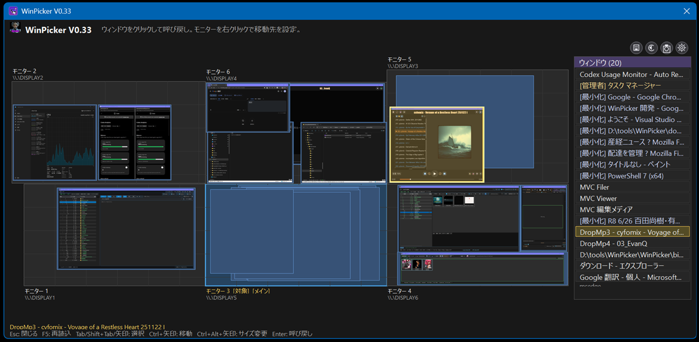

# WinPicker

**WinPicker** is a Windows 11 tray utility for multi-monitor environments. It helps you find windows scattered across monitors, minimized windows, and windows hidden behind other apps, then bring them back to a monitor you choose from a minimap UI.

- 日本語: [日本語版](#日本語)
- English: [English](#english)

GitHub: https://github.com/cyfomix-ui/



---

## 日本語

### 概要

WinPicker は、複数モニター上のウィンドウをミニマップと一覧から選んで、指定モニターへ呼び戻す Windows 11 向けタスクトレイ常駐ツールです。

Alt+Tab や Win+Tab では探しづらいウィンドウ、別モニターへ散らばったウィンドウ、最小化されたウィンドウを、素早く見つけて前面へ戻せます。

現在のミニ画面ヘッダーには `WinPicker V0.33` のようにバージョンが表示されます。

### 主な機能

- タスクトレイ常駐アプリとして動作
- `Win + Alt + Space` でミニ画面を表示 / 非表示
- `Win + Alt + Z` で直前の移動を元に戻す
- `Win + Alt + P` で全画面スクリーンショットを保存
- `Win + Alt` の短い長押しで、マウスカーソルを WinPicker のトレイアイコン付近へ移動
- `Alt` を素早く 2 回で、マウスカーソルをトレイ付近へ移動
- `Alt` を素早く 3 回以上で、カーソルをトレイ付近へ移動してミニ画面を表示
- `RightAlt + Space` で右手側操作としてミニ画面を表示
- `RightAlt + Z` で右手側操作として直前の移動を戻す
- 全モニターを縮小表示するミニマップ
- 右側のウィンドウ一覧とミニマップ選択が連動
- 一覧表示ありのときはマップ上にサムネイル表示、一覧非表示のときは文字中心表示
- 最小化ウィンドウも一覧に含め、選択時に復元して移動
- 判定できた管理者権限ウィンドウに `[管理者]` / `[Admin]` を表示
- モニター右クリックで移動先モニターを設定
- ジオメトリ保存 / 復元で、ウィンドウ配置とデスクトップアイコン位置を保存
- 日本語 OS / UI では日本語表示、それ以外では英語表示
- 単一インスタンスで動作
- `win-x64` の単一 EXE として発行可能

### 動作環境

- Windows 11
- .NET 8
- Visual Studio 2022 推奨
- 複数モニター環境推奨

ソースからビルドする場合は、Visual Studio の `.NET デスクトップ開発` ワークロードが必要です。

### 基本操作

| 操作 | 内容 |
|---|---|
| `Win + Alt + Space` | ミニ画面を表示 / 非表示 |
| `Win + Alt + Z` | 直前に移動したウィンドウを元に戻す |
| `Win + Alt + P` | 全画面スクリーンショットを保存 |
| `Win + Alt` を少し保持 | マウスカーソルをトレイ付近へ移動 |
| `Alt` を 2 回 | マウスカーソルをトレイ付近へ移動 |
| `Alt` を 3 回以上 | カーソルをトレイ付近へ移動してミニ画面表示 |
| `RightAlt + Space` | ミニ画面を表示 |
| `RightAlt + Z` | 直前の移動を戻す |
| `Esc` | ミニ画面を閉じる |
| `F5` | ウィンドウ一覧を再読み込み |
| `Tab` / `Shift + Tab` | 選択ウィンドウを移動 |
| 矢印キー | 選択ウィンドウを移動 |
| `Ctrl + 矢印キー` | ミニ画面自体を移動 |
| `Ctrl + Shift + 矢印キー` | ミニ画面を大きく移動 |
| `Ctrl + Alt + 矢印キー` | ミニ画面サイズを変更して保存 |
| `Ctrl + Alt + Shift + 矢印キー` | ミニ画面サイズを大きく変更して保存 |
| `Enter` | 選択中ウィンドウを呼び戻す |
| 一覧上でマウスホイール | 一覧をスクロール |
| 一覧上で `Ctrl + マウスホイール` | 一覧文字サイズを変更して保存 |

### 使い方

1. WinPicker を起動します。
2. タスクトレイに WinPicker アイコンが表示されます。
3. `Win + Alt + Space` を押すか、トレイアイコンを左クリックします。
4. ミニマップとウィンドウ一覧が表示されます。
5. ウィンドウをクリックするか、一覧で選択して `Enter` を押します。
6. 選択したウィンドウが設定済みモニターへ移動し、前面に表示されます。

### ミニ画面の操作

- マップ上のウィンドウをクリックすると、そのウィンドウを呼び戻します。
- ウィンドウ上へマウスを置くと、実ウィンドウ位置を枠線でハイライトします。
- モニターを右クリックすると、そのモニターを移動先に設定できます。
- 一覧とマップは同じ選択状態を共有します。
- 一覧上部のアイコンから、ジオメトリ保存 / 復元 / 全画面キャプチャ / 設定を実行できます。

### タスクトレイメニュー

トレイアイコンを右クリックすると、以下のメニューを開けます。

- 表示
- 直前の移動を戻す
- 設定
- WinPickerについて
- ログフォルダを開く
- 終了

### 設定項目

設定画面では、主に以下を変更できます。

- ミニ画面表示ホットキー
- 元に戻すホットキー
- ウィンドウの移動先モニター
- ミニ画面の表示位置
- 呼び戻し後にミニ画面を閉じるか
- ホットキー起動時にカーソルをトレイ付近へ移動するか
- 可能なら WinPicker の正確なトレイアイコン位置を使うか
- ミニ画面を最前面かつキー操作可能に保つか
- マップ上のプレビュー表示
- 右側ウィンドウ一覧の常時表示

ミニ画面の表示位置は以下から選べます。

- マウス位置 / トレイ位置付近
- Windows メインモニター中央
- 移動先モニター中央
- 指定モニター中央

### ジオメトリ保存 / 復元

WinPicker は以下をまとめて保存できます。

- ウィンドウ位置
- ウィンドウサイズ
- 最小化 / 最大化状態
- モニター配置情報
- デスクトップアイコン位置

保存名は自動で日時名になり、最大 8 件まで保持します。

保存先レジストリ:

```text
HKEY_CURRENT_USER\Software\Cyfomix\WinPicker\GeometrySnapshots
```

復元メニューでは、各保存データごとに以下を選べます。

- `ウィンドウ`
- `アイコン`

デスクトップアイコン位置の復元は Windows Explorer の内部状態に依存するため、ベストエフォートです。

### スクリーンショット

`Win + Alt + P` またはカメラアイコンから、全モニター範囲のスクリーンショットを JPEG で保存できます。

保存先:

```text
Pictures\WinPicker\yyyyMMdd_HHmmss.jpg
```

ミニ画面からキャプチャした場合は、WinPicker 自身を閉じてから保存します。

### 設定ファイルとログ

設定ファイルとログは EXE 横ではなく、ユーザーごとの AppData に保存されます。

```text
%APPDATA%\Cyfomix\WinPicker
```

主なファイル:

```text
%APPDATA%\Cyfomix\WinPicker\appsettings.json
%APPDATA%\Cyfomix\WinPicker\logs\yyyy-MM-dd.log
```

移動先モニター情報は次のレジストリにも保存されます。

```text
HKEY_CURRENT_USER\Software\Cyfomix\WinPicker
```

### ビルド

Visual Studio 2022 で `WinPicker.sln` を開き、通常は `F5` で実行します。

Release ビルドや配布用 publish は `WinPicker\WinPicker.csproj` を対象に行います。

### 単一 EXE 発行

配布用 EXE は以下で発行できます。

```powershell
dotnet publish .\WinPicker\WinPicker.csproj -c Release -r win-x64 --self-contained true /p:PublishSingleFile=true /p:PublishTrimmed=false /p:IncludeNativeLibrariesForSelfExtract=true /p:EnableCompressionInSingleFile=true
```

出力先:

```text
WinPicker\bin\Release\net8.0-windows\win-x64\publish\WinPicker.exe
```

補助スクリプト `Publish_WinPicker_v0_33.ps1` は、既存プロセス停止、バージョン確認、`bin/obj` クリーン、publish 実行をまとめて行います。

### 既知の制限

- 管理者権限アプリは、WinPicker も管理者権限で起動しないと移動できない場合があります。
- 一部の UWP アプリ、ゲーム、排他的フルスクリーン、特殊ウィンドウは移動や前面化が効かない場合があります。
- ブラウザ、動画再生、GPU 描画系アプリでは、プレビューが黒くなる、古いままになることがあります。
- タスクトレイアイコンの正確な位置取得は Windows 状態依存で、失敗時はトレイ付近へフォールバックします。
- デスクトップアイコン位置の復元は Windows Explorer の状態に依存します。

---

## English

### Overview

WinPicker is a Windows 11 tray utility that lets you pick windows from a minimap and bring them back to a monitor you choose. It is designed for multi-monitor setups where windows often end up scattered, buried, or minimized.

The picker header shows the current version, for example `WinPicker V0.33`.

### Features

- Runs as a task tray utility
- Show or hide the picker with `Win + Alt + Space`
- Restore the last move with `Win + Alt + Z`
- Save an all-screen screenshot with `Win + Alt + P`
- Hold `Win + Alt` briefly to move the mouse cursor near the WinPicker tray icon
- Double-tap `Alt` to move the mouse cursor near the tray
- Triple-tap `Alt` or more to move the cursor near the tray and open the picker
- Show the picker with `RightAlt + Space`
- Restore the last move with `RightAlt + Z`
- Display all monitors as a minimap
- Keep the window list and minimap selection synchronized
- Show thumbnail-first map tiles when the right-side list is enabled, and text-first tiles when the list is hidden
- Include minimized windows and restore them before moving
- Mark elevated windows as `[Admin]` when detectable
- Set the summon target by right-clicking a monitor
- Save and restore window layout plus desktop icon positions
- Japanese UI on Japanese Windows/UI culture, English UI otherwise
- Runs as a single instance
- Can be published as a single `win-x64` EXE

### Requirements

- Windows 11
- .NET 8
- Visual Studio 2022 recommended
- Multi-monitor setup recommended

If you build from source, install the Visual Studio `.NET desktop development` workload.

### Keyboard and Mouse Controls

| Shortcut / Action | Result |
|---|---|
| `Win + Alt + Space` | Show / hide picker |
| `Win + Alt + Z` | Restore the last moved window |
| `Win + Alt + P` | Save an all-screen screenshot |
| Hold `Win + Alt` briefly | Move the cursor near the tray |
| Double-tap `Alt` | Move the cursor near the tray |
| Triple-tap `Alt` or more | Move the cursor near the tray and show the picker |
| `RightAlt + Space` | Show picker |
| `RightAlt + Z` | Restore the last move |
| `Esc` | Close picker |
| `F5` | Refresh window list |
| `Tab` / `Shift + Tab` | Move selection |
| Arrow keys | Move selection |
| `Ctrl + Arrow keys` | Move the picker window |
| `Ctrl + Shift + Arrow keys` | Move the picker window faster |
| `Ctrl + Alt + Arrow keys` | Resize the picker and save the size |
| `Ctrl + Alt + Shift + Arrow keys` | Resize the picker faster and save the size |
| `Enter` | Summon selected window |
| Mouse wheel on the list | Scroll the list |
| `Ctrl + mouse wheel` on the list | Change and save list font size |

### Usage

1. Start WinPicker.
2. The WinPicker icon appears in the task tray.
3. Press `Win + Alt + Space`, or left-click the tray icon.
4. The minimap and window list appear.
5. Click a window, or select one from the list and press `Enter`.
6. The selected window is moved to the configured target monitor and brought to the front.

### Picker Behavior

- Clicking a window tile summons that window.
- Hovering a mapped window highlights the real window with a border overlay.
- Right-clicking a monitor sets it as the summon target.
- The list and map share the same current selection.
- The icon row above the list provides save layout, restore layout, capture all screens, and open settings actions.

### Tray Menu

Right-click the tray icon to open:

- Show
- Restore last move
- Settings
- About WinPicker
- Open logs folder
- Exit

### Settings

The Settings dialog can change:

- Show picker hotkey
- Restore hotkey
- Target monitor
- Picker placement
- Whether the picker closes after summoning
- Whether hotkey launch moves the cursor near the tray
- Whether WinPicker should prefer the exact tray icon position when available
- Whether the picker stays topmost and keyboard-controllable
- Whether map previews are shown
- Whether the right-side window list is always shown

Picker placement modes:

- Near mouse / tray area
- Center of Windows primary monitor
- Center of target monitor
- Center of a specific monitor

### Layout Save / Restore

WinPicker can store:

- Window position
- Window size
- Minimized / maximized state
- Monitor placement metadata
- Desktop icon positions

Snapshot names default to a timestamp, and up to 8 snapshots are kept.

Registry path:

```text
HKEY_CURRENT_USER\Software\Cyfomix\WinPicker\GeometrySnapshots
```

Each saved snapshot can restore:

- `Windows`
- `Desktop icons`

Desktop icon restore is best-effort because it depends on Windows Explorer internals.

### Screenshots

Use `Win + Alt + P` or the camera icon to save a JPEG covering all monitors.

Output path:

```text
Pictures\WinPicker\yyyyMMdd_HHmmss.jpg
```

If capture is triggered from the picker, WinPicker closes itself before saving the image.

### Settings and Logs

Settings and logs are stored in the user AppData folder, not beside the EXE.

```text
%APPDATA%\Cyfomix\WinPicker
```

Main files:

```text
%APPDATA%\Cyfomix\WinPicker\appsettings.json
%APPDATA%\Cyfomix\WinPicker\logs\yyyy-MM-dd.log
```

The selected target monitor is also written to:

```text
HKEY_CURRENT_USER\Software\Cyfomix\WinPicker
```

### Build

Open `WinPicker.sln` in Visual Studio 2022 and run with `F5` for normal development.

Release builds and publish output are produced from `WinPicker\WinPicker.csproj`.

### Publish as a Single EXE

```powershell
dotnet publish .\WinPicker\WinPicker.csproj -c Release -r win-x64 --self-contained true /p:PublishSingleFile=true /p:PublishTrimmed=false /p:IncludeNativeLibrariesForSelfExtract=true /p:EnableCompressionInSingleFile=true
```

Output:

```text
WinPicker\bin\Release\net8.0-windows\win-x64\publish\WinPicker.exe
```

The helper script `Publish_WinPicker_v0_33.ps1` stops running WinPicker processes, checks the source version, cleans `bin/obj`, and runs the publish step.

### Known Limitations

- Elevated applications may require WinPicker itself to run as administrator.
- Some UWP apps, games, exclusive fullscreen apps, and other special windows may resist moving or foreground activation.
- Browser, video, and GPU-rendered windows may show black or stale previews.
- Exact tray icon position detection depends on Windows taskbar state; WinPicker falls back to the general tray area when needed.
- Desktop icon restore depends on Windows Explorer state.

### Asset License

See `ASSETS_LICENSE.md` for bundled asset licensing notes.
